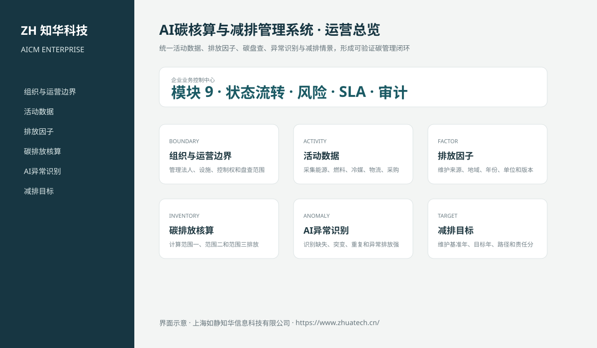
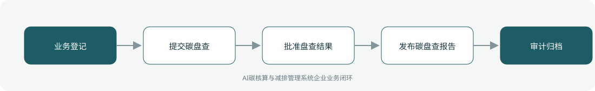

# ZhuaTech AICM｜AI碳核算与减排管理系统

> 统一活动数据、排放因子、碳盘查、异常识别与减排情景，形成可验证碳管理闭环

ZhuaTech AICM 是知华科技（上海如静知华信息科技有限公司）发布的企业级源码项目，面向“组织边界、活动数据、排放因子、范围一二三、AI异常、碳盘查、目标、减排情景、核证与披露”提供管理端与响应式业务端。工程采用前后端分离架构，所有示例数据均为虚构数据。

[知华科技官网](https://www.zhuatech.cn/) · [架构说明](docs/ARCHITECTURE.md) · [API 文档](docs/API.md) · [企业能力](docs/ENTERPRISE.md) · [测试说明](docs/TESTING.md)



## 业务模块

| 模块 | 核心能力 |
| --- | --- |
| 组织与运营边界 | 管理法人、设施、控制权和盘查范围 |
| 活动数据 | 采集能源、燃料、冷媒、物流、采购和差旅数据 |
| 排放因子 | 维护来源、地域、年份、单位和版本 |
| 碳排放核算 | 计算范围一、范围二和范围三排放 |
| AI异常识别 | 识别缺失、突变、重复和异常排放强度 |
| 减排目标 | 维护基准年、目标年、路径和责任分解 |
| AI减排情景 | 评估节能、绿电、工艺、物流和供应链方案 |
| 核证管理 | 管理抽样、证据、调整和独立核证 |
| 披露与审计 | 生成盘查报告并保留方法学和数据血缘 |



## 企业级控制

- ADMIN / OPERATOR 角色边界和管理员接口隔离；
- 服务端字段、模块、唯一编号和状态迁移校验；
- 组织、期间、责任人、风险等级、到期日和 SLA 统计；
- 幂等创建、JPA 乐观锁、重复提交保护和职责分离；
- 附件 SHA-256 元数据、业务凭证完整性与全流程审计；
- 组合检索、分页、逾期筛选、UTF-8 CSV 导出和协作时间线；
- 外部系统仅预留适配器，使用方自行配置地址与凭据；
- prod profile 拒绝默认密码、弱数据库口令和本地跨域来源。

## 技术架构

- 后端：Java 21、Spring Boot、Spring Security、JPA、Bean Validation、Actuator
- 前端：Vue 3、Vite、Axios，支持桌面端与移动端响应式布局
- 数据库：MySQL 8；自动化测试使用 H2
- 交付：Docker Compose、Nginx、环境变量、GitHub Actions
- Java 包名：`cn.zhuatech.aicarbonmanager`

## 启动与测试

```bash
cd backend && mvn test
cd ../frontend && npm install && npm run build
cd .. && cp .env.example .env && docker compose up --build
```

开发演示账号：`admin / admin123`、`operator / operator123`。生产环境必须通过环境变量替换全部默认凭据。

## 许可与商业授权

Copyright © 2026 上海如静知华信息科技有限公司。

本工程仅允许个人学习、研究和非商业技术交流，**不得用于商业用途**。企业内部使用、生产部署、SaaS运营、项目交付、品牌替换、收费培训、咨询实施或再分发，均须事先获得上海如静知华信息科技有限公司书面授权，详见 [LICENSE](LICENSE)。

深度开发、私有化部署、系统集成与企业数字化咨询，请访问[知华科技官网](https://www.zhuatech.cn/)或扫码联系：

| 微信咨询一 | 微信咨询二 |
| --- | --- |
|  |  |

SEO：AI碳核算与减排管理系统、AICM系统源码、企业数字化、Java企业系统、Vue管理系统、知华科技、上海如静知华信息科技有限公司。
